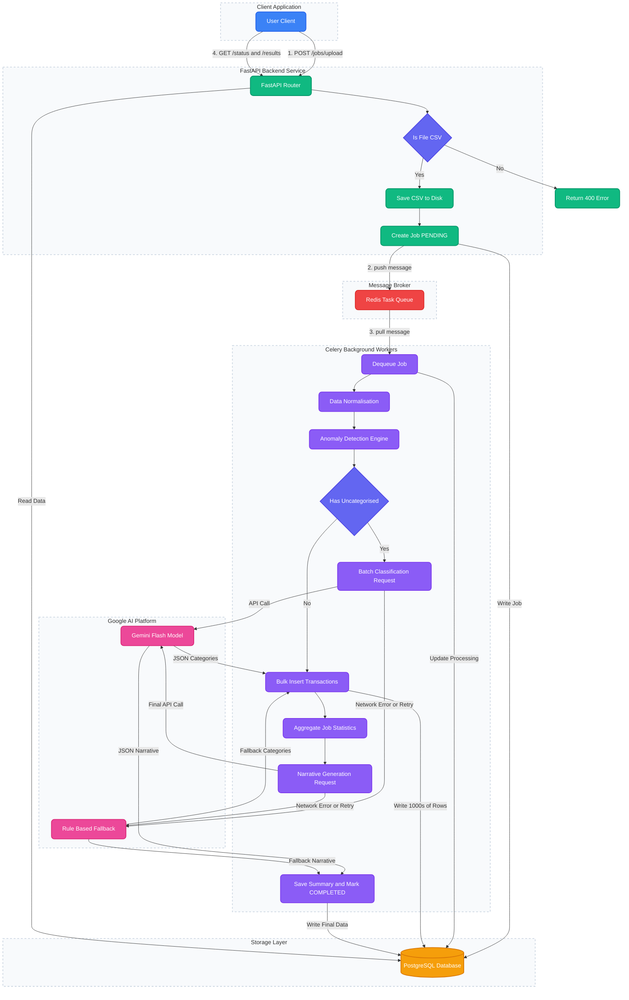
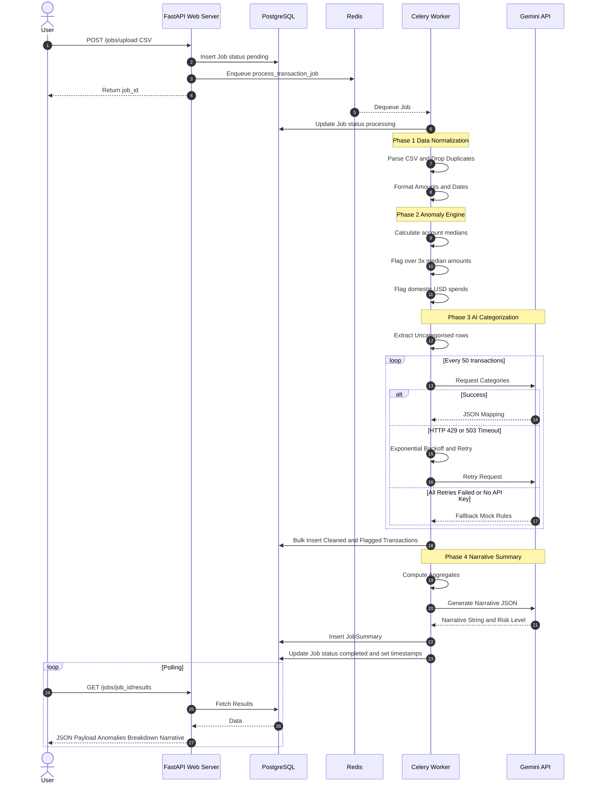

# AI-Powered Transaction Processing Pipeline

An asynchronous backend system that ingests financial transaction CSVs, cleans and normalises data, runs statistical and rule-based anomaly detection, classifies transaction categories in batches using Google Gemini 1.5 Flash (with a deterministic mock fallback), and generates a natural-language narrative spending summary — all exposed via a polling REST API.

**Stack:** FastAPI · Celery · Redis · PostgreSQL · Docker Compose

---

## Quick Start

```bash
# 1. Clone the repository
git clone https://github.com/prakhar-developer/alemeno.git
cd alemeno

# 2. (Optional) Set your Gemini API key for real LLM calls
#    Without it the pipeline runs perfectly using the built-in mock classifier
echo "GEMINI_API_KEY=your_key_here" > .env

# 3. Start everything
docker compose up --build -d

# 4. Verify all 4 containers are healthy
docker compose ps
```

The API is available at **http://localhost:8000**. Swagger docs at **http://localhost:8000/docs**.

---

## API Endpoints

### `POST /jobs/upload` — Submit a CSV file
```bash
curl -s -X POST http://localhost:8000/jobs/upload \
  -F "file=@transactions.csv" | python3 -m json.tool
```
**Response:**
```json
{
  "job_id": "bbdb2251-b191-4846-9b87-ccefe9f7d1fe",
  "status": "pending"
}
```

---

### `GET /jobs/{job_id}/status` — Poll processing status
```bash
curl -s http://localhost:8000/jobs/bbdb2251-b191-4846-9b87-ccefe9f7d1fe/status \
  | python3 -m json.tool
```
**Response (completed):**
```json
{
  "id": "bbdb2251-b191-4846-9b87-ccefe9f7d1fe",
  "status": "completed",
  "filename": "e96ab29b_transactions.csv",
  "row_count_raw": 95,
  "row_count_clean": 85,
  "created_at": "2026-06-22T16:02:47.330882",
  "completed_at": "2026-06-22T16:02:49.882410",
  "summary": {
    "total_spend_inr": 1339923.0,
    "total_spend_usd": 74185.14,
    "anomaly_count": 10,
    "risk_level": "high"
  }
}
```

---

### `GET /jobs/{job_id}/results` — Full structured output
```bash
curl -s http://localhost:8000/jobs/bbdb2251-b191-4846-9b87-ccefe9f7d1fe/results \
  | python3 -m json.tool
```
**Response shape:**
```json
{
  "id": "...",
  "status": "completed",
  "cleaned_transactions": [
    {
      "txn_id": "TXN001",
      "date": "2024-09-04",
      "merchant": "Zomato",
      "amount": 2536.35,
      "currency": "USD",
      "status": "SUCCESS",
      "category": "Food",
      "account_id": "ACC001",
      "notes": "Dinner with clients",
      "is_anomaly": true,
      "anomaly_reason": "USD transaction for domestic-only brand 'Zomato'"
    }
  ],
  "anomalies": [ "...subset of cleaned_transactions where is_anomaly=true..." ],
  "category_spend_breakdown": {
    "Shopping":  { "INR": 280715.73, "USD": 0.0 },
    "Food":      { "INR": 67045.08,  "USD": 43062.23 },
    "Travel":    { "INR": 450697.69, "USD": 31122.91 },
    "Transport": { "INR": 215704.49, "USD": 0.0 },
    "Utilities": { "INR": 270255.97, "USD": 0.0 }
  },
  "llm_summary": {
    "total_spend_inr": 1339923.0,
    "total_spend_usd": 74185.14,
    "top_merchants": [
      { "merchant": "Zomato",     "spend_inr": 0.0,       "spend_usd": 43062.23 },
      { "merchant": "MakeMyTrip", "spend_inr": 0.0,       "spend_usd": 31122.91 },
      { "merchant": "IRCTC",      "spend_inr": 450697.69, "spend_usd": 0.0 }
    ],
    "anomaly_count": 10,
    "narrative": "The transaction log details a total spending of 1,339,923 INR and 74,185 USD. The highest expenditures are at Zomato, MakeMyTrip, and IRCTC. With 10 flagged outliers including USD transactions for domestic-only brands, the account shows a high risk posture.",
    "risk_level": "high"
  }
}
```

---

### `GET /jobs` — List all jobs
```bash
# All jobs
curl -s http://localhost:8000/jobs | python3 -m json.tool

# Filter by status
curl -s "http://localhost:8000/jobs?status=completed" | python3 -m json.tool
```

---

## Running Tests

```bash
docker exec pipeline_fastapi pytest tests/test_pipeline.py -v
```

All 10 tests cover: amount cleaning, date normalisation, deduplication, median outlier detection, domestic-USD anomaly flagging, mock LLM classification, mock narrative generation, and FastAPI routing (upload → status → results → list).

---

## Architecture & Workflow




### Deep Dive: Processing Sequence & LLM Retry Logic



### Data Model


**`jobs`**

| Column | Type | Notes |
|--------|------|-------|
| id | VARCHAR(36) PK | UUID |
| filename | VARCHAR | stored filename on disk |
| status | VARCHAR | pending → processing → completed / failed |
| row_count_raw | INTEGER | rows in uploaded file |
| row_count_clean | INTEGER | rows after deduplication |
| error_message | TEXT | populated on failure |
| created_at | TIMESTAMP | |
| completed_at | TIMESTAMP | |

**`transactions`**

| Column | Type | Notes |
|--------|------|-------|
| id | INTEGER PK | auto-increment |
| job_id | VARCHAR FK | |
| txn_id | VARCHAR | original ID, nullable |
| date | DATE | normalised to ISO 8601 |
| merchant | VARCHAR | |
| amount | FLOAT | stripped of $ and commas |
| currency | VARCHAR | uppercased INR/USD |
| status | VARCHAR | uppercased SUCCESS/FAILED/PENDING |
| category | VARCHAR | cleaned or LLM-assigned |
| account_id | VARCHAR | |
| notes | TEXT | |
| is_anomaly | BOOLEAN | |
| anomaly_reason | TEXT | human-readable explanation |
| llm_category | VARCHAR | category suggested by LLM |
| llm_raw_response | TEXT | raw JSON string from Gemini (audit trail) |
| llm_failed | BOOLEAN | true if all 3 retries failed |

**`job_summaries`**

| Column | Type | Notes |
|--------|------|-------|
| id | INTEGER PK | |
| job_id | VARCHAR FK unique | |
| total_spend_inr | FLOAT | |
| total_spend_usd | FLOAT | |
| top_merchants | JSON | list of {merchant, spend_inr, spend_usd} |
| anomaly_count | INTEGER | |
| narrative | TEXT | LLM-generated 2-3 sentence summary |
| risk_level | VARCHAR | low / medium / high |

---

## Technical Reasoning & Design Choices

### 1. Architectural Pattern (Asynchronous Worker)
Why not process the CSV synchronously in the FastAPI endpoint?
- **Timeout Prevention:** Large CSVs or slow LLM API calls would cause HTTP requests to timeout. By offloading to Celery, the API responds instantly with a `job_id`.
- **Fault Tolerance:** If the LLM API drops the connection, Celery can retry the specific task using `tenacity` without the user having to re-upload the file.

### 2. Database Schema (PostgreSQL)
- **Separation of Concerns:** We split `jobs`, `transactions`, and `job_summaries` into distinct tables. This allows the API to poll the `jobs` table extremely fast without scanning heavy transaction data.
- **Auditability:** Added `llm_raw_response` and `llm_failed` columns to the `transactions` table. For financial systems, having a strict audit trail of *why* an AI made a decision is a mandatory compliance requirement.

### 3. Folder Structure
- **Flat App Domain:** The `app/` directory separates configurations (`config.py`), database engine (`database.py`), models, and routers (`main.py`). This prevents circular imports, a common trap in FastAPI.
- **Dedicated Tasks Module:** Keeping `tasks.py` separate from API routes ensures the Celery worker process only imports what it needs, keeping its memory footprint low.

### 4. Specific Library Choices
- **FastAPI + Pydantic:** Chosen for native async support, auto-generated Swagger UI, and strict data validation (`schemas.py`), which is critical for financial payloads.
- **Celery + Redis:** The industry standard for robust Python background processing. Redis acts as a blazing-fast in-memory queue, ensuring jobs are never lost even if the worker restarts.
- **Tenacity:** Used for exponential backoff during Gemini API calls. It elegantly handles transient HTTP 429 (Rate Limit) and 503 (Service Unavailable) errors without breaking the pipeline.
- **Pandas:** Chosen for the cleaning phase. Vectorized operations (like `df.drop_duplicates()`) are orders of magnitude faster than iterating row-by-row in pure Python.

---

## Request Lifecycle Trace

This is the exact step-by-step path of a single CSV upload request through the system.

### 1. Ingestion & Immediate Handoff
- **Client** makes a `POST /jobs/upload` request attaching `transactions.csv`.
- **FastAPI** (`app/main.py`) validates the file extension and reads the file into memory.
- FastAPI writes the raw file to the local Docker volume `/workspace/uploads/`.
- FastAPI creates a new `Job` record in **PostgreSQL** via SQLAlchemy, setting `status="pending"`.
- FastAPI calls `process_transaction_job.delay(job_id)`. This serializes the `job_id` into a JSON message and pushes it to the **Redis** broker queue.
- **API Response:** FastAPI immediately returns `HTTP 201 Created` with the `job_id`. *(Total synchronous time: ~50ms).*

### 2. Asynchronous Processing & AI Augmentation
- The **Celery Worker** process continuously polls Redis. It pops the message and begins executing `process_transaction_job` (`app/tasks.py`).
- **Worker** updates the Postgres `Job` record to `status="processing"`.
- **Worker** reads the CSV from the disk volume using **Pandas**.
- **Data Normalization:** The `clean_and_parse_csv()` utility drops duplicate rows, standardizes datetime strings into ISO 8601 objects, and strips currency symbols (`$`, `,`) casting amounts to floats.
- **Anomaly Engine:** `detect_anomalies()` calculates the mathematical median for each `account_id` and flags rows exceeding 3x the median. It also flags transactions in USD mapped to predefined domestic Indian merchants.
- **AI Categorization:** The worker identifies all transactions with the category "Uncategorised". It chunks them into blocks of 50 and fires a synchronous `POST` request to the **Gemini 1.5 Flash** REST API.
- *Retry Branch:* If the Gemini API returns a 503/429, `tenacity` intercepts the exception, sleeps for exponentially increasing durations, and retries up to 3 times. If it still fails, the fallback rules engine kicks in to prevent job death.

### 3. Data Persistence & Aggregation
- With clean amounts, flagged anomalies, and AI categories resolved, the Worker iterates over the DataFrame and executes a bulk `db.add_all()` to insert the rows into the Postgres `transactions` table.
- The Worker runs Pandas `.sum()` and grouping operations to calculate the `total_spend_inr`, `total_spend_usd`, and `top_merchants`.
- A final prompt containing these aggregates is sent to Gemini to generate a narrative paragraph and a `risk_level`.
- The Worker writes the `JobSummary` record to Postgres and updates the original `Job` record to `status="completed"`, attaching a `completed_at` timestamp.

### 4. Client Retrieval
- **Client** makes a `GET /jobs/{job_id}/results` request.
- **FastAPI** queries Postgres for the `Job` (to ensure it is completed), the `transactions` linked to the job, and the `job_summary`.
- FastAPI dynamically builds the category spend breakdown grouping, serializes the ORM objects through **Pydantic** models (stripping away internal DB IDs), and returns the final polished JSON payload.

---

## Scale Analysis

### The Breaking Point — Where 100× Traffic Breaks This System

| Component | Current Behaviour | Break Point |
|-----------|-----------------|-------------|
| **PostgreSQL connections** | Default SQLAlchemy pool: 5 connections + 10 overflow | At ~15 concurrent requests, new requests block waiting for a connection. At 100×, they time out with `QueuePool limit reached`. |
| **Celery concurrency** | Single worker process, 4 threads (`--concurrency=4`) | 4 jobs process simultaneously; all others queue. 100 concurrent uploads = ~25-job queue depth. SLA degrades linearly. |
| **File storage** | Uploads saved to a named Docker volume local to the host | With horizontal scaling (multiple web containers), Container B cannot read files written by Container A. Jobs fail with `FileNotFoundError`. |
| **Pandas in-memory CSV** | `pd.read_csv()` loads entire file at once | A 500 MB CSV would OOM the 512 MB worker container. Under 100× load with large files, the host OS OOM-killer terminates the worker. |
| **LLM call latency** | Synchronous `httpx` call blocks Celery thread | Gemini P95 latency ~3–5 s. 4 concurrent workers × 5 s = 20 concurrent blocked threads. Other jobs starve. |
| **Redis task result storage** | Results accumulate indefinitely | Without expiry, 100× jobs fills Redis memory. When Redis hits `maxmemory`, the broker starts evicting queued tasks, silently dropping jobs. (Fixed: `result_expires=3600`) |
| **No rate limiting on `/jobs/upload`** | Endpoint accepts unlimited concurrent uploads | A single misbehaving client can queue 10,000 jobs in seconds, saturating the Celery queue and disk I/O. |

### The Next Iteration — Enterprise Production Architecture

| Change | What & Why | Trade-off |
|--------|-----------|-----------|
| **PgBouncer connection pooler** | Sits between app and Postgres. Multiplexes thousands of app connections into Postgres's ~100 real connections. Prevents connection exhaustion at 100× load. | Adds one more moving part; prepared statements need special handling in session-mode pooling. |
| **Object storage (S3/GCS) for uploads** | Uploaded CSVs written to S3 instead of local disk. Workers download from S3 before processing. Enables horizontal scaling of both web and worker containers independently. | Adds ~100–300 ms latency per job for the S3 GET/PUT round-trip. Requires AWS/GCS credentials. |
| **Chunked CSV streaming** | Replace `pd.read_csv(file)` with `pd.read_csv(file, chunksize=1000)` and process chunks. Caps worker memory consumption to ~O(chunk_size) regardless of file size. | Anomaly detection (median calculation) needs a two-pass approach or approximate statistics (e.g., T-Digest) because you can't compute the global median in one pass. |
| **Celery task chaining + async LLM calls** | Split the monolithic `process_transaction_job` into a Celery chain: `clean → detect → classify → summarise`. Each step is its own task; failed steps can be retried independently. Use `httpx.AsyncClient` within an `asyncio` event loop for LLM calls to avoid blocking worker threads. | More complex error handling and state management across task boundaries. Requires Celery Canvas. |
| **Horizontal Celery worker scaling** | Deploy multiple worker containers (3–10) behind the same Redis queue. Docker Compose `scale: 4` or Kubernetes HPA based on Redis queue depth metric. | Workers compete for the same file if using local disk (requires S3 fix above). More workers = more DB connections (requires PgBouncer). |
| **Read replicas for reporting queries** | `GET /jobs/{id}/results` fetches all transactions — potentially 10,000+ rows. A read replica handles these heavy `SELECT`s without impacting the write path used by the Celery worker. | Replica lag means recently-completed jobs may not appear immediately on the replica. Need to route writes to primary, reads to replica. |
| **Rate limiting (slowapi)** | Apply per-IP rate limit on `POST /jobs/upload` (e.g., 10 uploads/minute). Prevents abuse and protects downstream storage and queue. | Legitimate burst traffic (e.g., a batch ETL job) needs to be accounted for with a higher or token-bucket limit. |
| **Structured logging + observability** | Replace `print`/`logger.info` with structured JSON logs (structlog). Add Prometheus metrics (job queue depth, LLM latency histograms, per-status job counts). Ship to Grafana. | Initial setup overhead; teams need to define and maintain SLOs around the metrics. |
